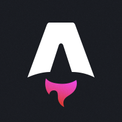

# Astro SSR [](https://github.com/stackblaze-templates/astro-ssr) [](https://stackblaze.com) [](https://github.com/stackblaze-templates/astro-ssr/actions) [](LICENSE) [](https://stackblaze.com)

<p align="center"></p>

A web framework for building content-driven websites. Astro ships zero JavaScript by default and supports server-side rendering with any UI framework.

> **Credits**: Built on [Astro SSR](https://astro.build) by [Astro](https://github.com/withastro). All trademarks belong to their respective owners.

## Deploy on StackBlaze

This template includes a `stackblaze.yaml` for one-click deployment on [StackBlaze](https://stackblaze.com).

## Local Development

```bash
docker compose up
```

See the project files for configuration details.

## Production Security

Before deploying to production, review the following:

- **Environment variables** — copy `.env.example` to `.env` and set all values. Never commit `.env` to version control.
- **`NODE_ENV`** — must be set to `production`. The Docker image and `docker-compose.yml` already set this; ensure your platform does the same.
- **Security headers** — `src/middleware.ts` adds `Content-Security-Policy`, `X-Frame-Options`, `X-Content-Type-Options`, `Referrer-Policy`, and `Permissions-Policy` headers to every response. Review and tighten the CSP policy for your specific deployment (e.g. remove `'unsafe-inline'` once you switch to a nonce-based approach).
- **Container security** — the Dockerfile runs as a non-root user (`appuser`, UID 1001) and uses a multi-stage build so build tooling is not present in the final image.

---

### Maintained by [StackBlaze](https://stackblaze.com)

This template is actively maintained by StackBlaze. We perform **weekly automated checks** to ensure:

- **Up-to-date dependencies** — frameworks, libraries, and base images are kept current
- **Security scanning** — continuous monitoring for known vulnerabilities and CVEs
- **Best practices** — configurations follow current recommendations from upstream projects

Found an issue? [Open a ticket](https://github.com/stackblaze-templates/astro-ssr/issues).
